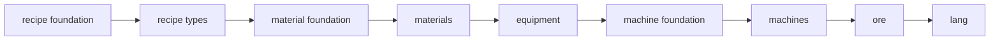

# Getting Started

## 添加依赖

```gradle
// build.gradle
repositories {
    maven { url = uri("https://maven.ptcrys.net/releases") }
}

dependencies {
    implementation "net.ptcrys:Topology:${topology_version}"
}
```

## TopoPlugin — 内容注册入口

所有内容（材料、机器、配方、矿石……）通过实现 `TopoPlugin` 接口注册：

```java
public final class MyModPlugin implements TopoPlugin {

    @Override
    public String modId() {
        return "mymod";
    }

    @Override
    public RegistryCore registry() {
        return MyMod.REGISTRY; // 你 Mod 的 RegistryCore
    }

    @Override
    public void registerMaterials(MaterialDomainRegistration m) {
        m.material("copper").lang("Copper", "铜").form(ingotForm).build();
    }

    @Override
    public void registerRecipeTypes(RecipeDomainRegistration r) {
        r.recipeType("macerating").name("Macerating", "粉碎").build();
    }

    @Override
    public void registerMachines(MachineDomainRegistration m) {
        // 声明机器
    }

    @Override
    public void registerRecipes(RecipeDomainRegistration r) {
        // 添加配方
    }

    @Override
    public void registerOreVeins(OreDomainRegistration o) {
        // 声明矿脉
    }

    @Override
    public void registerLang(LangDomainRegistration lang) {
        // 收集翻译
    }
}
```

在 Mod 主类中注册：

```java

@Mod("mymod")
public class MyMod {
    public static final RegistryCore REGISTRY = /* ... */;

    public MyMod() {
        TopoPlugins.register(new MyModPlugin());
    }
}
```

## 生命周期与冻结点

TopoPluginEngine 按固定顺序调用各阶段。每个阶段结束后，对应注册表 **冻结**（只读）：



| 阶段                | 做什么                                 | 冻结的注册表             |
|---------------------|----------------------------------------|--------------------------|
| recipe foundation   | 注册自定义 RecipeCapability            | capability 表            |
| recipe types        | 注册配方类型                           | recipe type 表           |
| material foundation | 注册自定义 MaterialData / MaterialForm | data / form 表           |
| materials           | 声明材料 + 注册 form 内容 + 后处理器   | material 表              |
| equipment           | 为 (kind, material) 生成物品           | —                        |
| machine foundation  | 冻结 resource type / UI / render       | resource type 表         |
| machines            | 声明机器 + 注册 block / block entity   | machine 表               |
| ore                 | 声明矿脉 + 数据生成                    | shape / mode / policy 表 |
| lang                | 收集所有翻译键                         | lang 表                  |

:::caution 冻结点规则 冻结点后不能再添加新条目。例如在 `registerMaterials()` 中不能再注册新的 `MaterialForm`——它必须放在
`registerMaterialFoundation()` 里。
:::

## 关键约定

- **ID 必须带命名空间**（如 `mymod:copper`）
- **双语名称**：每个有显示名称的条目必须提供 `en` 和 `cn`
- **Topology 只提供基建**：不在创造模式物品栏、JEI 中添加内容
