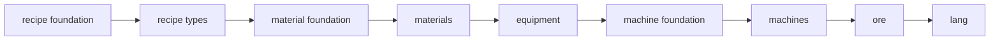

# Getting Started

## 添加依赖

```gradle
// build.gradle
repositories { 
    maven {
        name = "ptcrysReleases"
        url = uri("https://maven.ptcrys.net/releases")
    }
}
dependencies {
    implementation "net.ptcrys:Topology:${topology_version}"
}
```

## 架构：纯库 + 你的内容

Topology 只分发框架 API，**不分发任何玩法内容**。你需要的全部功能通过继承框架基类实现：

```
net.ptcrys.topo.api.* → 库本体（全部继承扩展点都在这里）
你的 Mod               → 继承基类 + TopoPlugin 注册，与库解耦
```

内容注册的唯一通道是 `TopoPlugin`——没有隐藏的特权通道。

## TopoPlugin — 内容注册入口

所有内容（材料、机器、配方、矿石……）通过实现 `TopoPlugin` 接口注册：

```java
public final class MyModPlugin implements TopoPlugin {

    @Override
    public String modId() {
        return "mymod";
    }

    @Override
    public RegistryCore registry() {
        return MyMod.REGISTRY; // 你 Mod 的 RegistryCore
    }

    @Override
    public MaterialDomainRegistration material() { return materials; }
    @Override
    public EquipmentDomainRegistration equipment() { return equipments; }
    @Override
    public RecipeDomainRegistration recipe() { return recipes; }
    @Override
    public MachineDomainRegistration machine() { return machines; }
    @Override
    public OreDomainRegistration ore() { return ores; }
    @Override
    public LangDomainRegistration lang() { return langs; }

    // 六个领域注册 API 通过 XDomainRegistration.of(this) 创建，
    // 框架校验它们与 modId()/registry() 一致。

    @Override
    public void registerMaterials(MaterialDomainRegistration m) {
        // ingotForm 是你在 registerMaterialFoundation 里注册的自定义形态（见 Material 文档）
        m.material("copper").lang("Copper", "铜").form(ingotForm).build();
    }

    @Override
    public void registerRecipeTypes(RecipeDomainRegistration r) {
        r.recipeType("macerating").displayName("Macerating", "粉碎");
    }

    @Override
    public void registerMachines(MachineDomainRegistration m) {
        // 声明机器
    }

    @Override
    public void registerRecipes(RecipeDomainRegistration r) {
        // 添加配方
    }

    @Override
    public void registerOreVeins(OreDomainRegistration o) {
        // 声明矿脉
    }

    @Override
    public void registerLang(LangDomainRegistration lang) {
        // 收集翻译
    }
}
```

## 接线：注册插件 + 启动引擎

```java
@Mod("mymod")
public class MyMod {

    public static final RegistryCore REGISTRY = /* ... */;

    public MyMod(IEventBus modEventBus) {
        // 1. 注册内容插件（引擎启动前，@Mod 构造器里）
        TopoPlugins.register(new MyModPlugin());

        // 2. 首个 RegisterEvent 上启动引擎——HIGHEST 优先级，保证
        //    所有 @Mod 构造器都已注册完毕，RegistryLib(LOW) 仍能看到队列条目。
        modEventBus.addListener(EventPriority.HIGHEST, this::bootstrap);

        // 3. 运行时绑定（你的内容专属，注册顺序注意见下）
    }

    private void bootstrap(RegisterEvent event) {
        TopoPluginEngine.prepare();            // recipe → material → equipment
        TopoPluginEngine.bootstrapMachine();   // machine foundation → machines → pipes
        TopoPluginEngine.bootstrapOre();       // ore foundation → veins
        TopoPluginEngine.bootstrapLang();      // lang 收集 + 冻结
    }
}
```

:::info
**库已经帮你做了什么** — Topology 的宿主 `@Mod("topo")` 已注册 API 插件、资源能力、管道引擎、网络、渲染、
tick 心跳等全部框架运行时。你的 Mod 只需要走上面三步——注册自己的插件、启动引擎、接上自己的运行时绑定。
:::

:::caution
**运行时绑定顺序** — 如果你的内容提供设备/材质/机器的物品悬浮面板（tooltip），其注册必须**先于**
`PipeSpecTooltips.register(...)`：后者的 setup 任务会 freeze `ItemTooltipUis`，而 `enqueueWork` 任务按提交序执行。
:::

## 生命周期与冻结点

TopoPluginEngine 按固定顺序调用各阶段。每个阶段结束后，对应注册表 **冻结**（只读）：



| 阶段                | 做什么                                 | 冻结的注册表             |
|---------------------|----------------------------------------|--------------------------|
| recipe foundation   | 注册自定义 RecipeCapability            | capability 表            |
| recipe types        | 注册配方类型                           | recipe type 表           |
| material foundation | 注册自定义 MaterialData / MaterialForm | data / form 表           |
| materials           | 声明材料 + 注册 form 内容 + 后处理器   | material 表              |
| equipment           | 为 (kind, material) 生成物品           | —                        |
| machine foundation  | 冻结 resource type / UI / render       | resource type 表         |
| machines            | 声明机器 + 注册 block / block entity   | machine 表               |
| ore                 | 声明矿脉 + 数据生成                    | shape / mode / policy 表 |
| lang                | 收集所有翻译键                         | lang 表                  |

:::caution
**冻结点规则** — 冻结点后不能再添加新条目。例如在 `registerMaterials()` 中不能再注册新的 `MaterialForm`——
它必须放在 `registerMaterialFoundation()` 里。完整生命周期表见
[Plugin Lifecycle](foundation/lifecycle.md)。
:::

## 关键约定

- **ID 必须带命名空间**（如 `mymod:copper`）
- **双语名称**：每个有显示名称的条目必须提供 `en` 和 `cn`
- **Topology 只提供基建**：不在创造模式物品栏、JEI 中添加内容
